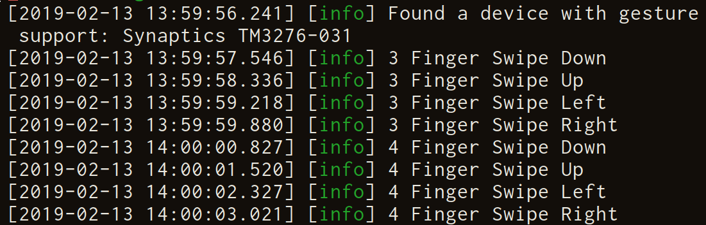

Gebaar
=========

WM Independent Gesture Daemon for libinput

_Gebaar means Gesture in Dutch_

### State of the project

- [x] Receiving swipe events from libinput
- [ ] Receiving pinch/zoom events from libinput
- [ ] Receiving rotation events from libinput
- [x] Converting libinput events to motions
- [ ] Running commands based on motions

### Screenshots of debug/testing output

